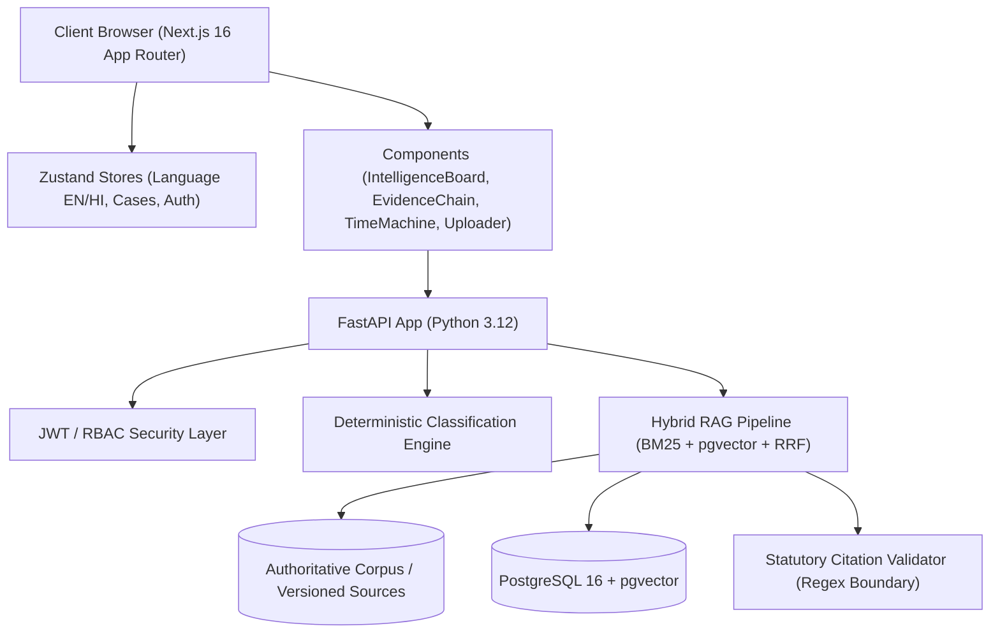

# IP-SAKTI SAHAYAK — PHASE 5 SYSTEM AUDIT & ARCHITECTURE REVIEW
## SIH26045 | Intellectual Property & Regulatory Decision Support Platform for Ayurveda

---

### 1. Executive Summary & Baseline State

This audit establishes the baseline for **Phase 5 (Production Hardening, Advanced Intelligence, UX Excellence, and SIH Judge Readiness)**. It verifies that all Phase 1–4 capabilities remain intact and defines the technical roadmap to convert the working prototype into an institution-grade, demonstrably trustworthy system.

**Baseline Verification:**
- **Backend Tests:** 13/13 passing (`pytest` with asyncio, testing classification, RAG retrieval, citation verification, prompt injection isolation, and source versioning).
- **Frontend Build:** Next.js 16.3.6 (Turbopack) build passing with 0 errors across all 12 routes (`/`, `/_not-found`, `/assistant`, `/cases`, `/cases/[id]`, `/cases/[id]/report`, `/cases/new`, `/evidence`, `/explore`, `/login`, `/register`, `/search`).
- **Core Principle Maintained:** *Rules Constrain, RAG Grounds, AI Explains, Citations Prove, Versioning Updates, Abstention Protects*.

---

### 2. Complete Architecture Review

#### A. Frontend Architecture (Next.js 16.3.6 + React 19 + TypeScript)
- **Routes:**
  1. `/`: Institutional Landing Page with 5 primary action workflows.
  2. `/search`: Hybrid search with intent classification and collapsible filters.
  3. `/explore`: Knowledge base explorer for Acts, Rules, Guidelines, and Gazettes.
  4. `/cases`: User cases management workspace.
  5. `/cases/new`: 8-step guided formulation intake wizard.
  6. `/cases/[id]`: Interactive Dossier (Formulation DNA, Evidence Chain, Regulatory Time Machine, Document Uploader, Evidence Gap Analysis).
  7. `/cases/[id]/report`: Formal printable Dossier / PDF-ready Intelligence Report.
  8. `/evidence`: Statutory Evidence Explorer with full corpus inspection.
  9. `/assistant`: Case-aware bilingual AI assistant with structured answers and prompt injection guards.
  10. `/login` & `/register`: Clean institutional authentication flows.
- **State & Localization:**
  - `src/store/language.ts`: Bilingual store supporting English and Hindi (with canonical preservation of statutory citations like Section 3(p), Rule 158B, Form III).
  - `src/store/cases.ts`: Client case management with representative demo cases.

#### B. Backend Architecture (FastAPI + SQLAlchemy 2.0 + pgvector)
- **Database Schema:** 13 tables defined in `backend/app/models/models.py` and `backend/scripts/init_schema.sql`:
  - `users`, `cases`, `formulations`, `classifications`, `ip_pathways`, `sources`, `source_versions`, `source_chunks` (with pgvector `vector(1536)`), `documents`, `evidence_gaps`, `case_reports`, `assistant_sessions`, `assistant_messages`, `audit_logs`, `expert_requests`.
- **RAG & Intelligence Engine:**
  - `hybrid_retriever.py`: Hybrid BM25 + dense vector retrieval merged using Reciprocal Rank Fusion (RRF).
  - `legal_chunker.py`: Legal-aware chunker preserving Section/Sub-section headers and Schedule hierarchies.
  - `statutory_validator.py`: Strict regex boundary validation ensuring no hallucinated legal citations exist in outputs.
  - `rag_pipeline.py`: Comprehensive decision pipeline with safe abstention triggers.

---

### 3. Working Features Inventory

| Feature | Component / Engine | State | Notes |
|---|---|---|---|
| **Deterministic Classification** | `engine.ts` / `test_classification.py` | **Working** | Accurately classifies Classical, Proprietary, Modified Classical, and Bio-Resource extraction. |
| **Applicable Statutory Regimes** | `engine.ts` | **Working** | Maps Drugs & Cosmetics Act, Patents Act, Biological Diversity Act, FSSAI Ayurveda Aahar. |
| **Evidence Chain** | `EvidenceChainView.tsx` | **Working** | Traces input -> facts -> classification -> statutory source -> pathway. |
| **Evidence Gap Detector** | `EvidenceGapView.tsx` | **Working** | Identifies missing classical text citations, safety testing, NBA approvals. |
| **Regulatory Time Machine** | `RegulatoryTimeMachine.tsx` | **Working** | Compares active vs superseded amendments (e.g. Biological Diversity Amendment Act 2023). |
| **Document Uploader** | `DocumentUploader.tsx` | **Working** | Client validation for MIME/size, prompt-injection defense tags, quarantine status. |
| **Citation Verification** | `statutory_validator.py` | **Working** | Regex boundary matching with strict suppression of ungrounded references. |
| **Safe Abstention** | `AbstentionBanner.tsx` / `rag_pipeline.py` | **Working** | Triggers whenever evidence confidence < threshold or query is out-of-scope. |
| **Printable Report** | `/cases/[id]/report` | **Working** | High-density formal institutional dossier with verification hashes and barcodes. |
| **Bilingual Support** | `language.ts` (EN/HI) | **Working** | Instant toggle preserving canonical identifiers (Section 3(p), Rule 158B). |

---

### 4. Technical Debt, Gaps & Areas for Phase 5 Hardening

1. **Homepage Intake Widget (Workstream 3):**
   - The homepage lists 5 workflow cards, but needs an interactive "What are you working with?" intake widget (Ayurvedic formulation, herbal product, plant resource, TK, novel process, brand, GI, regulatory question) to immediately funnel new users into the optimal workflow.
2. **Search Autocomplete & History (Workstream 4):**
   - Search supports query intent classification and filters, but needs client-side recent search persistence and suggested query chips for common statutory queries (`Section 3(p)`, `Rule 158B`, `Form III`, `FSSAI Ayurveda Aahar`).
3. **Formulation Wizard Dynamic Narrowing (Workstream 5):**
   - The 8-step wizard asks questions sequentially; Phase 5 needs dynamic conditional narrowing (e.g. skipping classical text queries if the user selects novel synthetic derivative).
4. **Formulation DNA Visual Representation (Workstream 6):**
   - Current DNA representation is tabular cards; needs an interactive scientific "DNA" strand / signature badge view showing botanical taxonomy, extraction matrix, and evidence completeness score.
5. **Evidence Node Explanations (Workstream 8):**
   - Needs explicit "Why this source?", "What does this source support?", and "What does this source NOT establish?" disclaimers to prevent legal misinterpretation.
6. **Evidence Gap Classification (Workstream 9):**
   - Gaps should be explicitly categorized into `CRITICAL`, `IMPORTANT`, and `OPTIONAL` with immediate actionable guidance.
7. **Security & Threats (Workstream 14):**
   - Need comprehensive `SECURITY_AUDIT.md` covering prompt injection isolation, file validation, rate limiting, and tenant data isolation.
8. **RAG Quality Evaluation (Workstream 15):**
   - Need measurable evaluation suite with golden queries and document findings in `RAG_EVALUATION.md`.
9. **SIH Judge & Deployment Documentation (Workstreams 27 & 29):**
   - Require `JUDGE_DEMO.md` (30s pitch, 2min demo, 5min walkthrough, technical defense) and `DEPLOYMENT.md`.

---

### 5. Prioritized Phase 5 Implementation Sequence

- **Step 1:** Workstream 1–3: Intelligent Homepage 2.0 with "What are you working with?" dynamic intake widget.
- **Step 2:** Workstream 4: Search 2.0 with suggested queries, autocomplete tags, and recent searches.
- **Step 3:** Workstream 5 & 6: Formulation Intelligence 2.0 & Formulation DNA 2.0 with scientific visual signature.
- **Step 4:** Workstream 7, 8 & 9: IP Pathway Mapper 2.0, Evidence Node Explanations ("Why this source?", "What it supports / does not establish"), and Tri-Tier Evidence Gaps (`CRITICAL`, `IMPORTANT`, `OPTIONAL`).
- **Step 5:** Workstream 14: Security Hardening & `SECURITY_AUDIT.md`.
- **Step 6:** Workstream 15: RAG Quality Evaluation Suite & `RAG_EVALUATION.md`.
- **Step 7:** Workstream 22 & 27: Polished SIH Demo Mode & `JUDGE_DEMO.md`.
- **Step 8:** Workstream 29: Production Deployment Guide `DEPLOYMENT.md` & verification.
- **Step 9:** Quality gate tests, build verification, and `PHASE5_COMPLETION_REPORT.md`.
