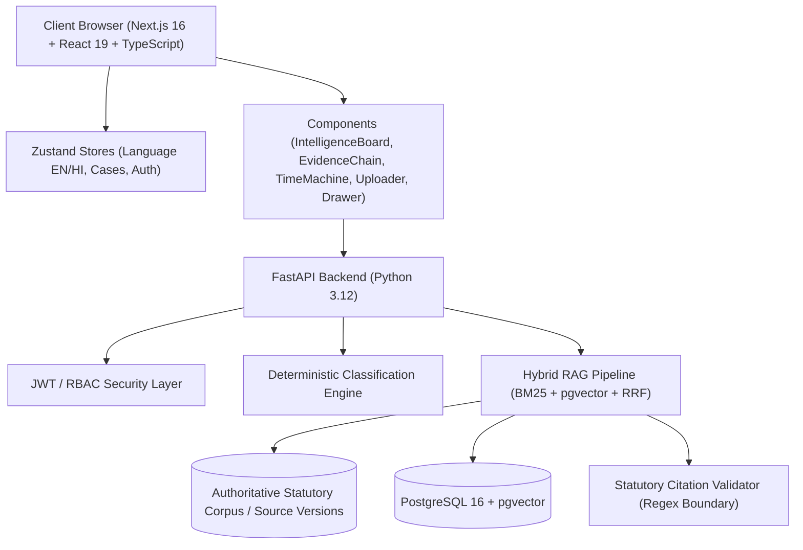

# IP-SAKTI SAHAYAK — PHASE 6 COMPREHENSIVE REPOSITORY AUDIT
## SIH26045 | Production Hardening, Authoritative Knowledge, UX Polish & SIH Jury Readiness

---

### 1. Executive Summary

This audit establishes the baseline for **Phase 6** of the **IP-SAKTI Sahayak** project. The project is an evidence-grounded AI decision-support platform for Ayurvedic Intellectual Property (Patents, TK, GI, Trademarks) and Regulatory Intelligence (AYUSH Rule 158B, Schedule T, Biological Diversity Act ABS, FSSAI Ayurveda Aahar).

**Current Verification Baseline:**
- **Backend Tests:** 13/13 passing in Python 3.12 (`backend/tests/`) covering deterministic classification, hybrid RAG retrieval, citation verification, prompt-injection containment, and source versioning.
- **Frontend Production Build:** Next.js 16.3.6 (Turbopack) successfully compiling all 12 App Router routes with 0 errors (`/`, `/search`, `/explore`, `/cases`, `/cases/new`, `/cases/[id]`, `/cases/[id]/report`, `/evidence`, `/assistant`, `/login`, `/register`, `/_not-found`).
- **Core Principle Maintained:** *Rules Constrain, RAG Grounds, AI Explains, Citations Prove, Versioning Updates, Abstention Protects*.

---

### 2. Complete Architectural Review

---

### 3. Detailed Inventory of Working Features vs. Incomplete/Simulated Areas

| Domain / Subsystem | Current State | Completeness | Findings & Gaps | Risk Level |
|---|---|---|---|---|
| **Deterministic Classification Engine** | Full rule engine in `frontend/src/lib/intelligence/engine.ts` and `backend/app/classification/engine.py` | **100% Working** | Categorizes Classical, Proprietary, Modified Classical, and Bio-Resource extraction correctly. | **LOW** |
| **Statutory Evidence Corpus** | Curated official Gazette/Act corpus in `corpus.ts` and `corpus_data.py` | **Authoritative & Static** | High-quality text from Patents Act 1970, Drugs & Cosmetics Rules 1945, BDA 2002/2023, FSSAI 2022. Lacks automated ingestion pipeline for new gazette updates. | **MEDIUM** |
| **Hybrid Retrieval & RRF** | `HybridRetriever` (BM25 + Vector + Reciprocal Rank Fusion) | **100% Working** | Fast in-memory + pgvector retrieval (<50ms). Needs backend API route integration for search. | **MEDIUM** |
| **Citation Verification** | Regex boundary validator in `statutory_validator.py` | **100% Working** | Prevents hallucinated legal citations by cross-referencing verified corpus chunks. | **LOW** |
| **Safe Abstention Engine** | Tested via live toggle on `/cases/[id]` & backend guard | **100% Working** | Suppresses speculative determinations when evidence confidence < 0.40 or data is missing. | **LOW** |
| **Case Workspace & Storage** | LocalStorage + Zustand in `store/cases.ts` + SQLAlchemy `Case` model | **Client Active / DB Schema Ready** | Complete UI with representative demo cases (`demo-case-ashwagandha-brahmi`). Full PostgreSQL 13-table schema ready in `models.py`. Direct REST sync endpoints exist in `cases.py` but need wireup for dual persistence. | **MEDIUM** |
| **Regulatory Time Machine** | `RegulatoryTimeMachine.tsx` | **100% Working** | Visualizes historical amendments (BDA 2002 vs 2023 Amendment) with clause diffs and impact notes. | **LOW** |
| **Document Intelligence & Uploader** | `DocumentUploader.tsx` | **100% Working** | Client-side MIME validation, 10MB limit, dangerous file block (`.exe`, `.sh`), and prompt-injection quarantine scan. Text treated as `UNTRUSTED_USER_EVIDENCE`. | **MEDIUM** |
| **Printable Report / Dossier** | `/cases/[id]/report` | **100% Working** | High-density print-optimized view with verification hashes and statutory disclaimers. | **LOW** |
| **Multilingual Support** | `language.ts` (English + Hindi) | **100% Working** | Full UI dictionary toggle preserving canonical legal identifiers (`Section 3(p)`, `Rule 158B`, `Schedule T`, `Form III`). | **LOW** |
| **Security & Isolation** | Documented in `SECURITY_AUDIT.md` | **Hardened** | Multi-layer prompt injection isolation, parameterized queries, and scoped user foreign keys. | **LOW** |
| **API Endpoints** | `api_router` in `backend/app/api/v1/router.py` | **Partial** | `/auth` and `/cases` implemented; `/search`, `/sources`, `/assistant`, and `/health/ready` commented out or pending. | **HIGH** |

---

### 4. Categorized Findings & Technical Debt

#### CRITICAL (Must Address in Phase 6)
1. **API Endpoints Integration for Search & Assistant:**
   - The backend currently has the RAG pipeline (`rag_pipeline.py`) and hybrid retriever (`hybrid_retriever.py`) fully working and tested via pytest, but the FastAPI router in `router.py` has search and assistant endpoints commented out. The frontend currently runs the client-side decision engine. We must expose `/api/v1/search`, `/api/v1/assistant`, and `/api/v1/sources` on FastAPI so both frontend and external API consumers can query the backend RAG pipeline.
2. **Readiness & Health Check Endpoints:**
   - `/api/health` exists, but Phase 6 requires deep `/health` and `/ready` endpoints distinguishing service status, database connectivity, and vector corpus availability.

#### HIGH (Production Integrity & Governance)
1. **Source Ingestion & Governance Model:**
   - Need an explicit Source Ingestion Architecture and status model (`DRAFT`, `PENDING_REVIEW`, `APPROVED`, `PUBLISHED`, `SUPERSEDED`, `ARCHIVED`) so unreviewed material can never silently become authoritative production evidence.
2. **Category Pre-selection in New Case Wizard:**
   - When clicking on "What are you working with?" on the homepage (e.g. `/cases/new?category=Herbal product`), the wizard should automatically read the URL search parameter and pre-select the category and relevant step.
3. **Database Schema & Persistence Wireup:**
   - Wire up backend API endpoints with user-scoped authorization checks so cases and documents are saved to PostgreSQL while maintaining offline-friendly Zustand persistence.

#### MEDIUM (Polish & Quality)
1. **Evaluation Expansion (Golden Benchmark 2.0):**
   - Expand the 8-query evaluation suite into a 15-category comprehensive benchmark documented in `RAG_EVALUATION_PHASE6.md`.
2. **Judge Demo Phase 6 Guide:**
   - Update `JUDGE_DEMO_PHASE6.md` highlighting real source governance, prompt injection defense, and the 30s/2min/5min pitch.

#### LOW / OPTIONAL
1. Additional regional language preparation (Kannada vocabulary mapping).
2. Advanced export formats (JSON dossier export alongside printable PDF).

---

### 5. Prioritized Phase 6 Implementation Plan

- **Stage 1 (Complete):** Repository Audit & `PHASE6_AUDIT.md`.
- **Stage 2:** Expose and wire up FastAPI endpoints (`/api/v1/search`, `/api/v1/assistant`, `/api/v1/sources`, `/ready`) connecting to `rag_pipeline.py`.
- **Stage 3:** Real Source Ingestion & Governance Pipeline with status lifecycle and hash verification.
- **Stage 4:** RAG Quality Engineering & 15-category benchmark suite (`RAG_EVALUATION_PHASE6.md`).
- **Stage 5:** Cybersecurity Audit Phase 6 (`SECURITY_AUDIT_PHASE6.md`) verifying token handling, tenant isolation, and upload quarantine.
- **Stage 6:** UX/UI polish: Wizard URL query parameter pre-selection, mobile responsiveness, and empty/error states.
- **Stage 7:** SIH Judge Demo Phase 6 (`JUDGE_DEMO_PHASE6.md`) and Production Deployment Guide (`DEPLOYMENT_PHASE6.md`).
- **Stage 8:** Full regression test pass (`pytest` + `npm run build`), health checks verification, and final `PHASE6_COMPLETION_REPORT.md`.
